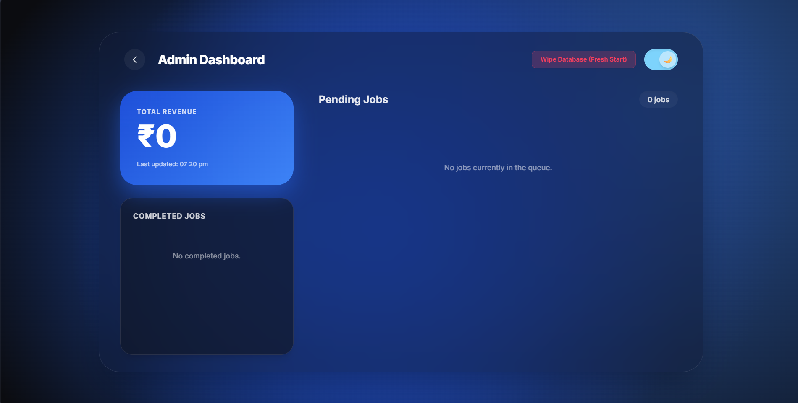
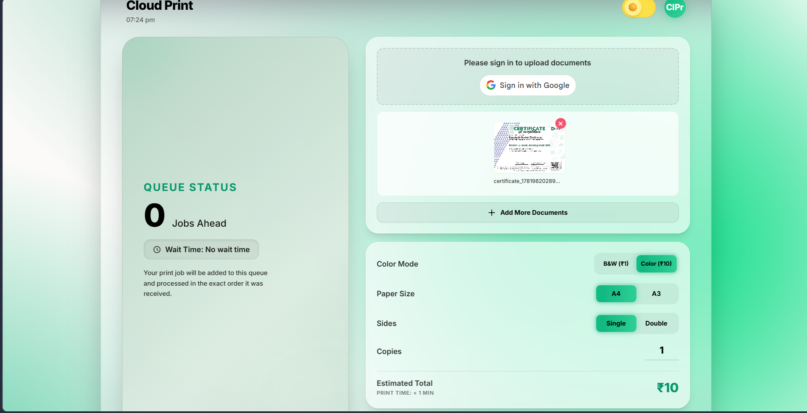

<div align="center">

# ☁️ Cloud Print System

### Cloud-Native Print Queue Management Platform

A secure and scalable **cloud-based print queue management system** that enables users to upload documents, configure print settings, make secure online payments via **PhonePe**, and track print jobs in real time. Administrators can efficiently manage print queues, documents, payments, and job statuses through a centralized dashboard.


</div>

---

# 🚀 Overview

Cloud Print Queue System modernizes the traditional printing workflow by combining **FastAPI**, **Microsoft Azure**, and **PhonePe Payment Gateway** into a unified cloud platform. Users can upload documents, customize print settings, pay securely online, and monitor their print requests, while administrators manage the complete printing lifecycle from a centralized dashboard.

---

# 📸 ScreenShots

### User Interface



### User Document Upload



### Admin Interface


---

# ✨ Features

### 👤 User

* 📄 Upload PDF/documents
* 🖨️ Configure print settings
* 📑 Paper size, orientation & duplex options
* 🎨 Color / Black & White printing
* 🔢 Multiple copies & page selection
* 💰 Automatic cost estimation
* 💳 Secure PhonePe payments
* 📊 Queue tracking
* 🧾 Download payment receipts
* 📜 Print history

### 👨‍💼 Admin

* Dashboard overview
* Queue management
* Print job monitoring
* Payment verification
* Customer management
* Search & filters
* Analytics & reporting

### ⚡ RESTful API

- High-performance FastAPI backend
- Interactive Swagger documentation
- ReDoc API documentation
- Clean API architecture

### ☁️ Cloud

* Azure App Service
* Azure SQL Database
* Azure Blob Storage
* Secure environment variables
* Scalable cloud deployment

---

# 🏗️ Architecture

```text
              User Portal
                    │
                    ▼
       Upload & Configure Print Job
                    │
                    ▼
            FastAPI REST Backend
        ┌────────────┬─────────────┬
        ▼            ▼             ▼
 Azure Blob      PhonePe       SQLAlchemy
   Storage       Payment            ORM
        │            │              │
        └────────────┼──────────────┘
                     ▼
            Azure SQL Database
                     │
                     ▼
          Queue Management Engine
                     │
                     ▼
              Admin Dashboard
```

---

# 🛠️ Tech Stack

| Category | Technologies                          |
| -------- | ------------------------------------- |
| Backend  | Python, FastAPI, SQLAlchemy, Uvicorn  |
| Frontend | HTML, CSS, JavaScript                 |
| Database | Azure SQL Database                    |
| Cloud    | Azure App Service, Azure Blob Storage |
| Payment  | PhonePe Payment Gateway               |

---

# 📂 Project Structure

```text
CloudPrintQueueSystem/
│
├── assets/
│   └── Screenshots/
|       ├── User.png
│       ├── Upload.png
│       └── Admin.png
|
├── static/
├── requirements.txt
├── .env.example
├── main.py
├── check_setup.py
├── clear_jobs.py
├── database.py
├── models.py 
├── schemas.py
├── update_theme.py
└── README.md
```

---

# ⚙️ Installation

### Clone the Repository

```bash
git clone https://github.com/KaustubhDeshmane/CloudPrintSystem.git
cd CloudPrintSystem
```

### Create Virtual Environment

```bash
python -m venv venv
```

**Windows**

```bash
venv\Scripts\activate
```

**Linux/macOS**

```bash
source venv/bin/activate
```

### Install Dependencies

```bash
pip install -r requirements.txt
```

### Configure Environment Variables

```env
DB_SERVER=
DB_NAME=
DB_USERNAME=
DB_PASSWORD=

AZURE_STORAGE_CONNECTION_STRING=
AZURE_STORAGE_CONTAINER=

PHONEPE_MERCHANT_ID=
PHONEPE_SALT_KEY=
```

### Run the Server

```bash
uvicorn main:app --reload
```

---

# 📚 API Documentation

| Documentation | URL                           |
| ------------- | ----------------------------- |
| Swagger UI    | `http://localhost:8000/docs`  |
| ReDoc         | `http://localhost:8000/redoc` |

---

# ☁️ Azure Services

* Azure App Service
* Azure SQL Database
* Azure Blob Storage
* Azure Resource Group

---

# 🔒 Security

* Environment-based configuration
* Secure Azure SQL connections
* Azure Blob Storage
* Input validation with FastAPI
* SQLAlchemy ORM protection
* PhonePe payment verification
* Production-ready configuration

---

# 🚀 Highlights

* Cloud-native architecture
* Modular FastAPI backend
* RESTful API design
* Azure cloud integration
* Secure online payments
* Scalable storage
* Interactive Swagger documentation
* Responsive user interface

---

# 🎯 Future Improvements

* JWT Authentication
* Docker support
* CI/CD pipeline
* Email notifications
* Real-time queue updates
* Multi-printer support
* Azure Key Vault integration
* Admin analytics dashboard

---

# 🤝 Contributing

Contributions are welcome!

1. Fork the repository
2. Create a new feature branch

```bash
git checkout -b feature/your-feature
```

3. Commit your changes

```bash
git commit -m "Add your feature"
```

4. Push your branch

```bash
git push origin feature/your-feature
```

5. Open a Pull Request

---

# 📜 License

This project is licensed under the **MIT License**.

---

# 👨‍💻 Author

**Kaustubh Deshmane**

Passionate about building scalable cloud applications, backend systems, and modern software solutions.

---

# 📬 Contact

Feel free to reach out for collaboration, feedback, or project discussions.

* **GitHub:** **@KaustubhDeshmane**

---

<div align="center">

### ⭐ If you found this project helpful, consider giving it a star!

**Built with ❤️ by Kaustubh Deshmane**

</div>
